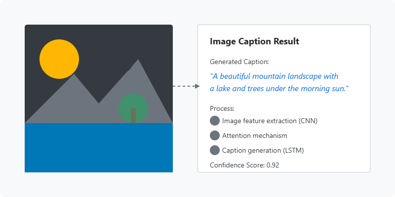
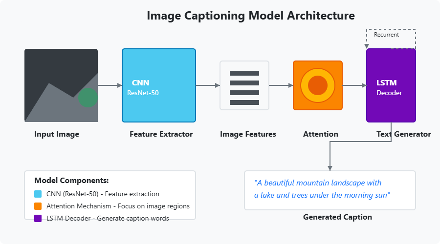
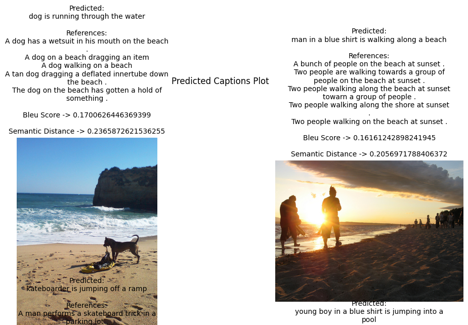

# Image Captioning using TensorFlow

An end-to-end deep learning system that generates natural language descriptions for images using TensorFlow.

## Overview

This project implements an image captioning model using a CNN-RNN architecture in TensorFlow. The model takes an image as input and generates a descriptive caption as output. The CNN component extracts visual features from the input image, while the RNN (specifically an LSTM network) generates captions based on these features.

## Features

- Pre-trained CNN (ResNet-50) for feature extraction
- LSTM-based decoder for sequence generation
- Attention mechanism to focus on different parts of the image
- Beam search for improved caption generation
- Support for different datasets (MSCOCO, Flickr8k, Flickr30k)
- Training and evaluation scripts
- Inference API for caption generation on new images
- Web interface for demonstration

## Requirements

- Python 3.8+
- TensorFlow 2.8+
- NumPy
- Matplotlib
- Pillow
- NLTK
- pandas
- tqdm

## Dataset Preparation

The project supports training on the following datasets:
- MS COCO
- Flickr8k
- Flickr30k

## Model Architecture

The model uses a CNN-RNN architecture:

1. **Feature Extractor**: A pre-trained ResNet-50 CNN extracts visual features from the input image.
2. **Attention Mechanism**: An attention layer that learns to focus on different parts of the image.
3. **Decoder**: An LSTM network that generates words sequentially based on the image features and previous words.

## Results

Some sample results from our model:

## Future Work

- Implement Transformer-based architecture
- Support for multi-lingual captioning
- Incorporate visual question answering capabilities
- Improve captioning of rare objects and activities
- Add style transfer for generating captions in different styles

## License

This project is licensed under the MIT License - see the [LICENSE](LICENSE) file for details.
